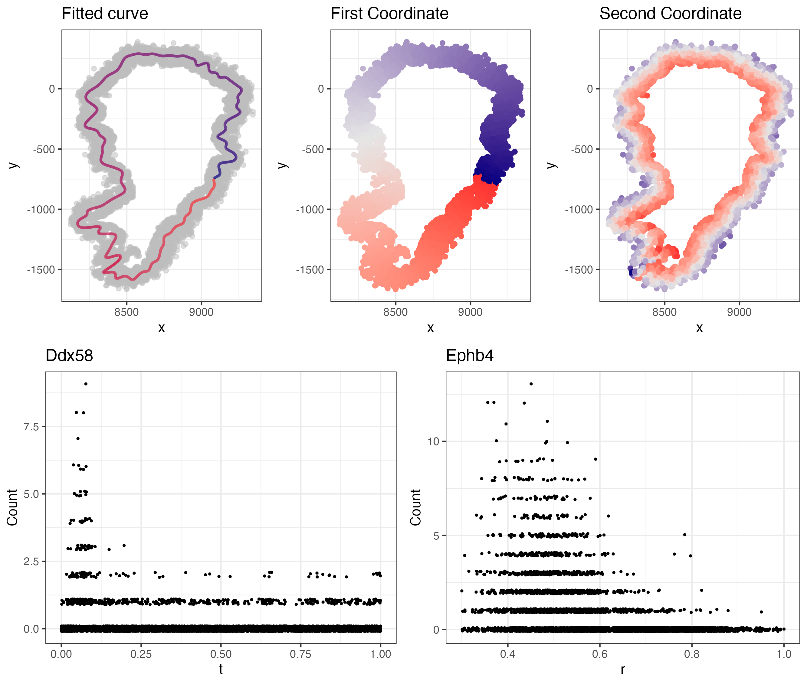
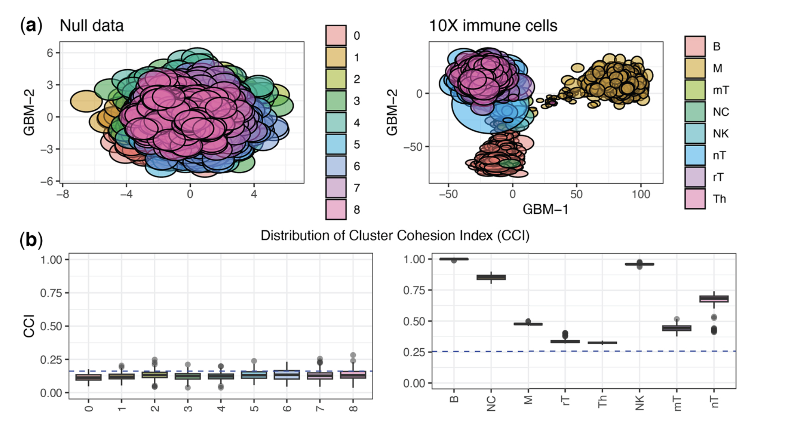
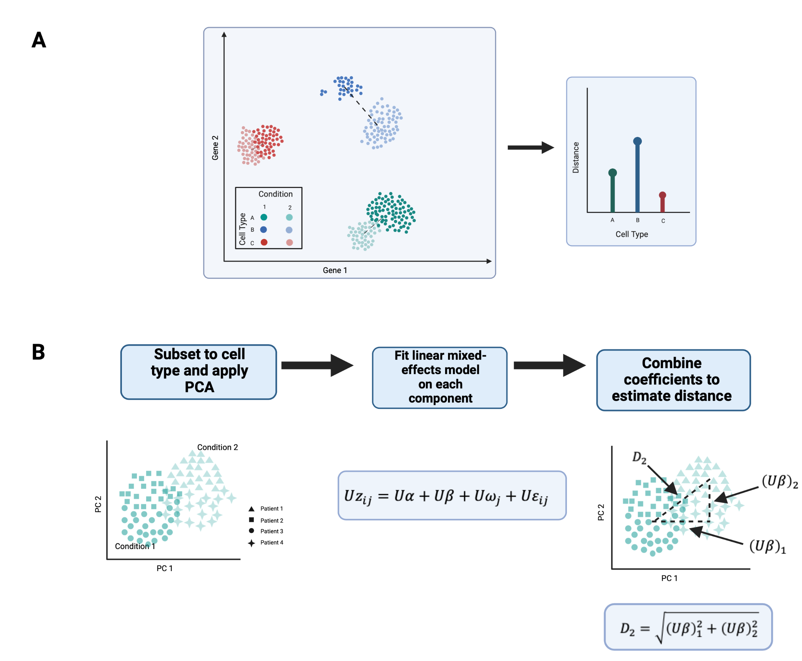
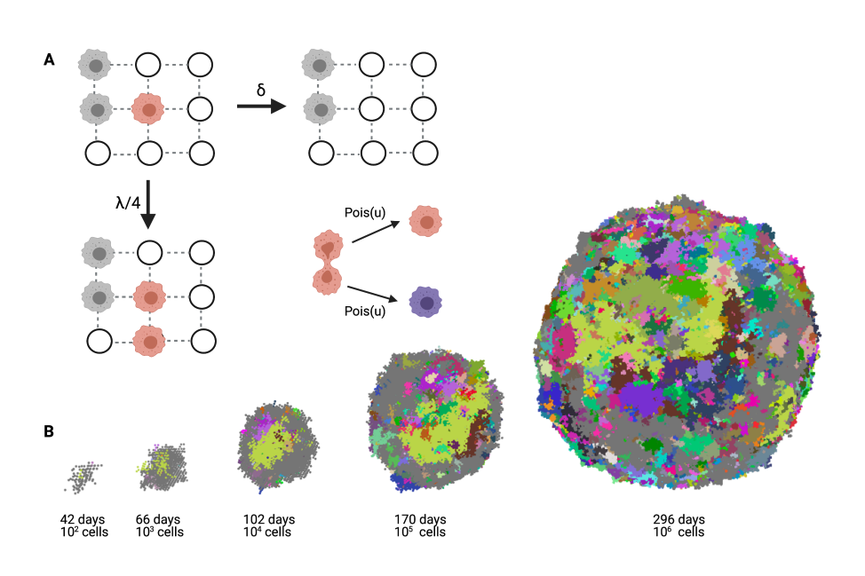

I am a fifth year PhD student in Department of Biostatistics at Harvard University, where I am co-advised by Dr. Rafael Irizarry and Dr. Jeff Miller. Prior to joining the Biostatistics department, I was a mathematics major at Harvard.

My research interests lie at the intersection of statistics and genomics. My recent work includes:

1.  Dimensionality reduction for single-cell genomic data
2.  Manifold learning for spatial transcriptomics
3.  Integration of high-dimensional random matrices

Email: phillipnicol\@g.harvard.edu

<!-- Simple slideshow -->

::: {#slideshow .slideshow}
     <!-- add more  lines as needed -->
:::

```{=html}
<style>
#slideshow {
  position: relative;
  width: 100%;
  max-width: 720px;
  margin-top: 1rem;
  overflow: hidden;
  border-radius: 6px;
  aspect-ratio: 16 / 9;      /* keeps box proportional and responsive */
  background: #f6f6f6;
}

/* Use 'contain' to scale the whole image to fit the box (no cropping).
   If you prefer filling + cropping, use 'cover' instead. */
#slideshow img {
  position: absolute;
  inset: 0;
  width: 100%;
  height: 100%;
  object-fit: contain;
  object-position: center;
  opacity: 0;
  transition: opacity 1s ease-in-out;
  display: block;
}

#slideshow img.active { opacity: 1; }
</style>
```

```{=html}
<script>
(function(){
  const slides = document.querySelectorAll('#slideshow img');
  if (!slides.length) return;
  let idx = 0;
  slides[idx].classList.add('active');
  setInterval(() => {
    slides[idx].classList.remove('active');
    idx = (idx + 1) % slides.length;
    slides[idx].classList.add('active');
  }, 4000); // change interval (ms) if you want
})();
</script>
```
